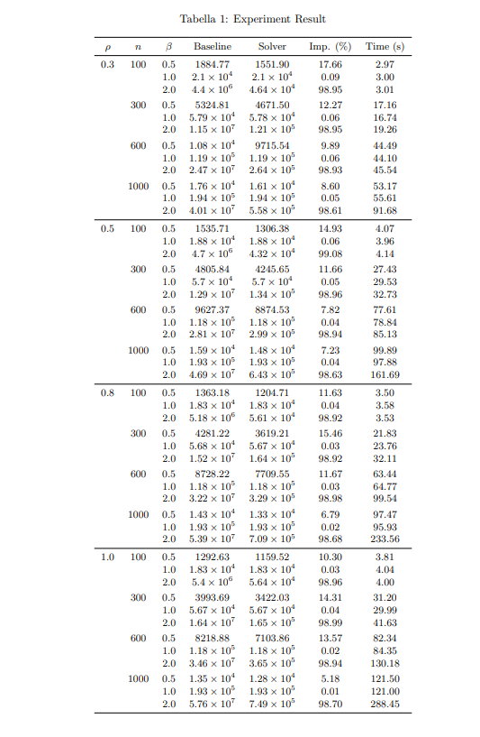

# Adaptive Solver for Orienteering Problem with Constraints

## Project Overview

This project implements a **hybrid adaptive solver** for the Orienteering Problem (OP) with weight-dependent costs. The solver automatically selects between **Genetic Algorithm** and **Hill Climbing** based on problem density and applies intelligent mutation strategies to optimize solutions.

### Problem Definition

Given a graph with:
- **Nodes**: Each node (except depot 0) contains collectable gold
- **Edges**: Weighted distances between nodes
- **Objective**: Design a path starting and ending at depot (node 0) that:
  - Visits selected nodes exactly once to collect gold
  - Minimizes total cost = distance + (α × distance × weight)^β
  - Optimizes trip distribution to reduce weight penalties

### Key Features

- **Density-Based Algorithm Selection**: 
  - Sparse networks (density < 0.8) → Genetic Algorithm
  - Dense networks (density ≥ 0.8) → Hill Climbing
  
- **Intelligent Mutation Operator**: Smart node insertion with path reconstruction
- **Trip Count Optimization**: Distribute gold across multiple trips to reduce weight penalties when β > 
- **Intelligent Crossover Operator**: Change of a segment (a minimal sub path from 0 to 0) with path reconstruction

---

## KEY POINTS

### 1. Fast and Efficient Greedy Population Creation
* **Shortest Path Precomputation:** All-pairs shortest paths from node 0 are computed using Dijkstra’s algorithm at startup.
* **Greedy Construction:** To build an individual, the algorithm selects a node where gold has not yet been collected, visits it via the shortest path, and collects gold from any city encountered along the way.
* **Population Strategy:** This method creates a diverse population for the GA in low-density scenarios. In high-density cases, where greedy solutions tend to converge, a single individual is generated and then refined via Hill Climbing.
* **Computational Complexity:** This approach ensures a creation time of $O(n)$ per individual.

### 2. Insertion Mutation with Optimal Segment Reconstruction
This multi-step mutation maintains path validity while enabling smart exploration:
1. Select a random node with an active flag in a segment and identify the next node.
2. Find the k-nearest neighbors of the next node and connect the current node to a new target via the shortest Dijkstra path.
3. Deactivate any duplicate gold nodes elsewhere in the path.
4. **Reconstruct:** If a segment becomes empty, it is removed; otherwise, it is rebuilt by connecting the depot to the first and last active nodes using the initialization paths.
* **Optimization Benefit:** Instead of random walk mutations, this chooses insertion targets based on proximity, providing the search with a meaningful direction.

### 3. Crossover with Segment Replacement and Delta-Based Cost
This operator exchanges segments between parents while maintaining path validity:
1. Pick a random segment from parent 1 and locate a corresponding segment in parent 2 using a key gold node as an anchor.
2. Replace parent 2's segment with parent 1's segment, merging the paths.
3. **Duplicate Management:** Remove gold nodes present in the new segment from their original positions in parent 2, and re-insert any orphaned nodes using the greedy initialization logic.
4. **Delta Computation:** Calculate cost differences incrementally ($Old - New$) to update the total cost.
* **Efficiency:** Delta-based cost calculation enables $O(\text{segment})$ complexity instead of requiring a full $O(n)$ recomputation.

### 4. Trip Mutation: Weight Distribution Optimization
If the parameter $\beta > 1$, it is often beneficial to perform multiple trips along the same path.
* **Data Structure:** The path structure is computed once, while trip counts are stored separately in the `trip_counts` list.
* **Radical Phase:** All trip counts are multiplied simultaneously to test for a global benefit.
* **Refinement Phase:** A random segment is selected and its trip count is modified via Hill Climbing.
* **Local Acceptance:** The modification is accepted only if the specific segment's cost improves, avoiding full path recomputation.

---

## Implementation Details

### Main Components

- **`adaptive_solver()`**: Orchestrator - selects GA or HC based on density
- **`genetic_algorithm()`**: Population-based search with adaptive tournament selection and recombination
- **`hill_climbing()`**: Local search from greedy initialization
- **`choice_a_path()` + `neighborhood_greedy_strategy_dijistra()`**: Greedy population initialization with pre-computed shortest paths from depot
- **`mutation_neighbor_of_next_insertion_only()`**: Core insertion mutation with segment reconstruction and duplicate detection
- **`crossover_zero_paths_with_delta()`**: Intelligent segment exchange operator with path merging and cost delta calculation
- **`run_hill_climbing_trips()`**: Trip count optimization via hill climbing

#### Hyperparameter Configuration Strategy

To achieve a balance between solution quality and computational efficiency, the solver employs adaptive hyperparameters that scale with problem size:

- **Population Size**: Small populations for large problems reduce computational cost while maintaining solution space exploration
- **Generations**: Fewer generations for larger problems since computational cost per evaluation increases with path length
- **Trip Count Iterations**: Dedicated iterations for weight distribution optimization when β > 1

This adaptive approach ensures that even with relatively modest computational budgets for large instances, the solver achieves competitive solution quality.

#### Hyperparameter Values by Problem Size

| Problem Size (n) | Population | Generations | Trip Count HC |
|------------------|-----------|------------|---------------|
| **100** | 25-50 | 80 | 100 |
| **1000** | 9-18 | 30 | 500 |

**Note**: 
- Population formula: `population_size = 25 - (n - 100) / 56` (doubled for sparse graphs with density < 0.8)
- Generations formula: `n_generations = 80 - (n - 100) / 18`
- Trip Count HC: `n_trip_count_hc = n` (halved if n ≥ 800)

### Adaptive GA Control Parameters

The genetic algorithm employs **dynamic control parameters** that evolve during the search to balance exploration and exploitation:

#### Tournament Selection Pressure
- **Range**: Tournament size increases from 2 to 6 across generations
- **Effect**: Selective pressure gradually increases, favoring stronger individuals in later generations
- **Rationale**: Early generations preserve diversity; later stages focus on exploitation of promising regions

#### Adaptive Crossover Probability
- **Initial Rate**: Low base crossover probability (0.1)
- **Dynamic Adjustment**: Probability increases during search stagnation to encourage exploration

The GA prioritizes **mutation as the primary exploration mechanism** rather than following traditional GA conventions; mutation is typically classified as an exploitation operator,but in this case introduces significant path novelty by intelligently repositioning nodes. On the other hand the crossover recombine segments from high-quality solutions

## Performance Analysis by Beta Factor

The solver's effectiveness varies significantly with the β parameter, which controls weight penalty strength. Below is a comprehensive performance summary:

| Beta | Scenario | Avg Improvement | Key Insight |
|------|----------|-----------------|------------|
| **0.5** | Low weight penalty | ~11.2% | Collecting gold and visit near city help the cost decrease |
| **1.0** | Linear weight scaling | ~0.04% | Single-trip solution already near-optimal |
| **2.0** | Quadratic weight penalty | ~98.9% |  Multiple trips dramatically reduce cost |

### Experiment Results

The table above presents comprehensive experimental results across different problem densities (ρ), problem sizes (n), and beta parameters (β), comparing the baseline solution quality against the solver's performance.

